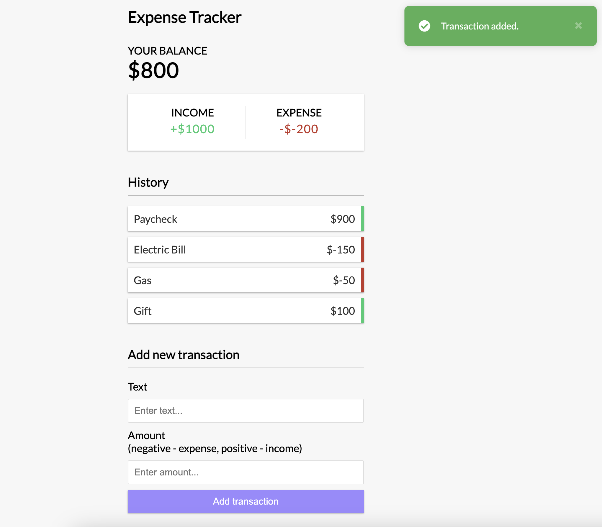

# Vue 3 Expense Tracker (Tutorial Project)

An expense tracker application built with Vue 3 and the composition API.

- Add and remove expenses/income
- Track balance
- Save data to local storage
- [Vue Toastification](https://github.com/Maronato/vue-toastification) for notifications
- `<script setup>` syntax (Vue 3.2+)



## Project Setup

```sh
npm install
```

### Compile and Hot-Reload for Development

```sh
npm run dev
```

### Compile and Minify for Production

```sh
npm run build
```

# Notes and Author Credit

This is a tutorial project created by following Brad Traversy's tutorial video found on YouTube at the following link (original author of tutorial project): https://www.youtube.com/watch?v=hNPwdOZ3qFU
